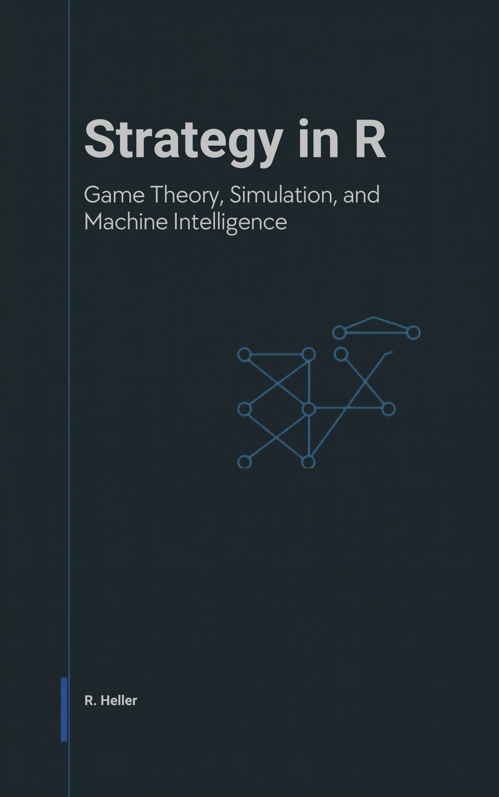

# Welcome! {-}

A free, open-source book on game theory, simulation, and machine intelligence — implemented end-to-end in R.

## About this book {-}

*Strategy in R* brings two ideas together: the formal language of game theory and the practical computation that makes it tractable. Part I builds the foundations from scratch — normal- and extensive-form games, Nash equilibrium, mixed strategies, Bayesian games, repeated games, and cooperative game theory. Part II tours the R toolkit (`GameTheory`, `CoopGame`, `gtree`, `nashpy` via `reticulate`, custom solvers).

Parts III and IV move into simulation and AI: Monte Carlo methods, agent-based models, Axelrod's tournament, replicator dynamics, evolutionarily stable strategies, network games, performance with Rcpp, then reinforcement learning, multi-agent RL, self-play and AlphaZero, counterfactual regret minimisation, GANs as minimax games, and LLM agents.

Parts V and VI close with applications (auctions, mechanism design, matching markets, bargaining, empirical case studies) and a section on ethics and the future of strategic AI.

The book is for graduate students, researchers, and practitioners with working R fluency who want to apply it to strategic interaction. It assumes no prior game-theory background. It is not a pure-mathematics textbook, not a general machine-learning textbook, and not a software-engineering manual.

## How to use this book {-}

- **Reading paths.** Front-to-back works; theorists can skim Parts II–IV; R programmers can dip into Parts II–IV and refer back to Part I as needed.
- **Code lives** under `R/` (helpers, theme, solvers) and `python/` (CFR, deep RL via `reticulate`); example data under `data/`. Every chapter is rebuildable in isolation: `bookdown::preview_chapter("12-gtree-package.Rmd")`.
- **Per-chapter PDF.** Every chapter page has a "⬇ Download this chapter (PDF)" button in the top-right.
- **Whole-book downloads.** The PDF and EPUB are linked from the navbar's Download menu.
- **Corrections and suggestions** go to the [issue tracker](https://github.com/r-heller/strategy-in-r/issues).

## License {-}

The content of this book is released under the [Creative Commons Attribution 4.0 International License](https://creativecommons.org/licenses/by/4.0/) (see [`LICENSE-CONTENT`](https://github.com/r-heller/strategy-in-r/blob/main/LICENSE-CONTENT)). Source code is released under the [MIT License](https://opensource.org/licenses/MIT).

## Citing this Guide {-}

The suggested citation is:

> Heller, R. (2026). *Strategy in R: Game Theory, Simulation, and Machine Intelligence* (Version v0.1.0). Self-published via GitHub Pages. <https://r-heller.github.io/strategy-in-r/>.

Download the reference as [BibTeX](citation-files/citation.bib) or [RIS](citation-files/citation.ris).

For the standalone *Citing this Guide* page (with the same downloads), see the back of the book.
